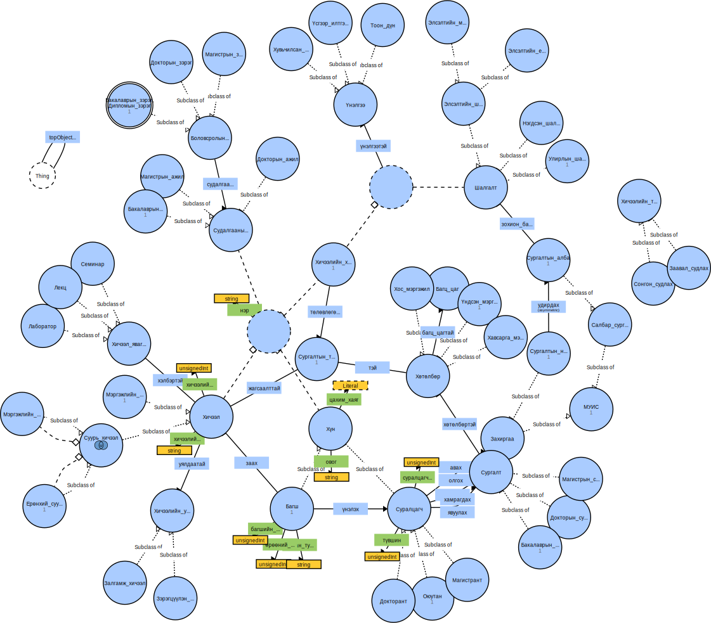

	

# МУИС сургалтын айн онтологи

## Танилцуулга
Энэ ажлаар МУИС-ийн сургалтын үйл явцад хамаарах мэдлэг мэдээллийг агуулсан 
онтологийг амжилттай үүсгэж туршлаа. Онтологид харьяалагдах нэгж ойлголт, нэр томьёо зэргийг 
МУИС-ийн сургалтын журам дээр үндэслэн Монгол хэл дээр оруулж ашигласан ба эдгээрт харгалзах нийт 56 ширхэг 
классыг тодорхойлж тэдгээрийн үе шатлал, харилцан хамаарлыг зааж өгсөн.
Цаашид энэхүү онтологи дээр бусад мэдээллийн нөөцийг холбож баяжуулан нэгж баримтуудыг олноор оруулж утга зүйгээр 
мэдээллийг хайж илрүүлэх семантик аппликейшн хөгжүүлэх бүрэн боломжтой.

## Дэлгэрэнгүй
Уг ажлын тайлан өгүүллийг сонирхохыг хүсвэл [энд](https://github.com/enhush/muis-curriculum-ontology/blob/master/paper/main.pdf) дарна уу!

## Лиценз
[MIT](http://opensource.org/licenses/MIT)
